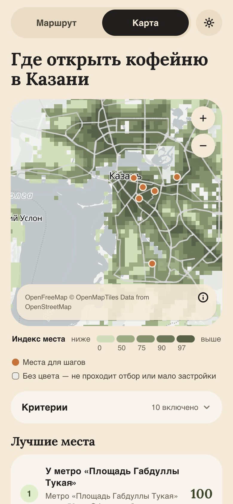
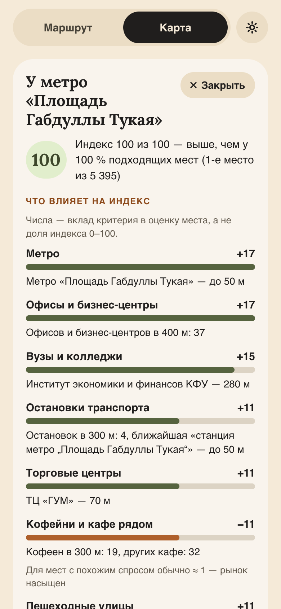
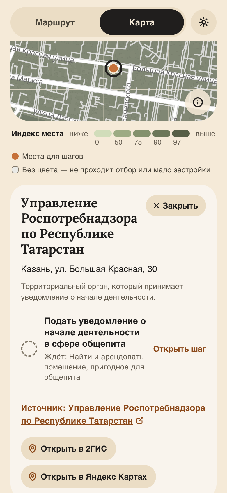
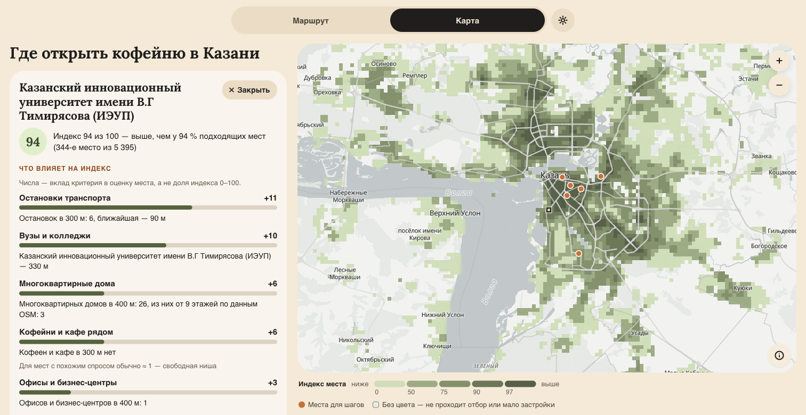
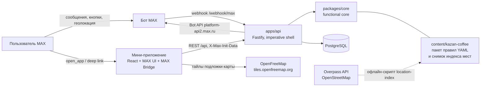

# Студенческий хакатон MAX - команда SoloTech

# Открывай

**Сервис в MAX, который за 2 минуты показывает владельцу будущей первой кофейни три действия, способные сорвать дату открытия, и ведёт его по критическому пути до готовности.**

Трек «Эффективный бизнес», хакатон MAX 2026. Чат-бот [@t750_hakaton_max_bot](https://max.ru/t750_hakaton_max_bot) + мини-приложение.

| | |
|---|---|
| Бот в MAX | https://max.ru/t750_hakaton_max_bot |
| Мини-приложение и API (стенд) | https://otkryvay.stasvinokur.ru |
| OpenAPI | [openapi.yaml](openapi.yaml) |
| Контракт проверок API | [DATA-API.yaml](DATA-API.yaml) |
| Тестовые данные и учётные записи | [docs/test-data](docs/test-data/README.md) |
| Скриншоты | [docs/screenshots](docs/screenshots) |
| Презентация (PDF) | https://docs.google.com/presentation/d/1Q8os5CInvg6777b-z2pc2DWmmTG03k6IxHPFeG6IO_Y/edit?usp=sharing |
| Видео основного сценария | [SoloTech_Demonstration.mp4](SoloTech_Demonstration.mp4) |
| Репозиторий для проверки | https://github.com/stasvinokur/student_hackathon_max_2026 |

## Назначение

**Пользователь** — ИП или микрокомпания (0–15 сотрудников), открывающая первую кофейню или coffee-to-go в Казани.

**Проблема.** Требования к открытию разбросаны по ФНС, Роспотребнадзору, «Честному знаку», «Меркурию», мэрии;
порядок зависит от формата, статуса регистрации, помещения и штата; ошибка в последовательности сдвигает открытие.

**Решение.** Бот задаёт 7 вопросов и строит персональный маршрут из пакета правил: какие действия относятся
именно к этому предпринимателю, в каком порядке их делать, до какой даты начать и какие три действия сейчас
угрожают дате открытия. У каждой карточки — ссылка на официальный источник и пометка о происхождении данных; дата
проверки источника хранится в пакете правил и приходит в API.
Если к выбранной дате обязательные шаги не успеть, маршрут говорит, когда реально можно открыться, если начать
сегодня (прогноз), считает сроки шагов от этой даты — у невыполненных шагов прошедших сроков нет, — а бот предлагает
перенести открытие одной кнопкой, не теряя отметок.
Маршрут, блокеры, сроки и прогноз считает детерминированный движок правил — не ИИ.

**Карта.** В мини-приложении два раздела — «Маршрут | Карта». Карта показывает, где в Казани искать помещение
(индекс мест для кофейни по открытым данным OpenStreetMap) и где находятся учреждения для шагов маршрута — подробнее
в разделе [«Карта мест»](#карта-мест).

## Основной пользовательский сценарий

1. Пользователь открывает бота в MAX и нажимает «Начать».
2. Бот задаёт 7 вопросов кнопками (или текстом): формат точки → город (геолокация или название) → статус регистрации →
   помещение → сотрудники → дата открытия → готовая еда.
3. Итог в чате: «До открытия N дней. Найдено K действий. Три действия могут сорвать запуск: …» и кнопки
   «Открыть маршрут» (мини-приложение) и «Начать с №1» (карточка первого блокера прямо в чате). Если выбранную дату
   не успеть, в итоге есть строка «К … не успеть — если начать сегодня, откроетесь …», а следующим сообщением бот
   предлагает «Перенести на …» или «Оставить …».
4. Мини-приложение, раздел «Маршрут»: дни до открытия и дата (под ней — предупреждение, если дату не успеть), прогресс,
   карточка «Следующий шаг», блокеры, три полосы действий; карточка действия (теги статуса и типа, «Начать до … · обычно
   N дней» или «Начать сегодня · обычно N дней», «Зачем», «Что сделать сейчас», «Что подготовить», «Выполнено, когда»,
   «Сначала нужно», источник, «Выполнено»), экран готовности с кольцом процента, текстом «Уйдёт в чат» и кнопкой
   «Поделиться с партнёром».
5. Раздел «Карта»: где искать помещение (индекс мест с настраиваемыми критериями) и где находятся учреждения для шагов.
   Из карточки шага — «Подобрать район на карте» и «Показать на карте», с карты — «Открыть шаг».
6. Бот напоминает о следующем шаге и о приближении крайних дат; кнопка в напоминании открывает мини-приложение
   сразу на нужной карточке.

**Светлая и тёмная тема.** Справа от «Маршрут | Карта» — кнопка темы: солнце в светлой теме, луна в тёмной (для
экранной читалки — переключатель «Тёмная тема»). Она перекрашивает всё мини-приложение и карту. Пока кнопку не нажимали, тема
следует за MAX. После первого нажатия выбор главнее системной схемы.
[Скриншот тёмной темы](docs/screenshots/07-route-map-dark.png).

**Возможности MAX сверх минимума**: кнопка геолокации для определения города; напоминания от бота и шеринг статуса готовности
с партнерами.

## Карта мест

Раздел «Карта» помогает выбрать район для поиска помещения и показывает места шагов маршрута. Индекс мест — модельная
оценка на подготовленных данных (срез OpenStreetMap на 24.09.2026). На экране — заголовок, карта с легендой, критерии и списки. Ограничения и лицензия описаны здесь, в [«Данные карты и лицензии»](#данные-карты-и-лицензии) и [«Известные ограничения»](#известные-ограничения).

| Индекс мест по Казани | Карточка места | Место шага на карте |
|---|---|---|
|  |  |  |

На широком экране — развёрнутый веб-клиент MAX, планшет:



**Индекс мест для кофейни.** Застроенная часть Казани разбита на квадраты 300 м: в индексе 5 395 квадратов — там, где
не меньше 3 зданий или есть объект спроса. Методика — 10 критериев. Для каждого квадрата снимок хранит уровни 0–100
по 9 из них, для конкуренции — число кофеен и других кафе в 300 м, а также проверяемые факты:

- **8 критериев спроса:** метро, остановки транспорта, вузы и колледжи, офисы и бизнес-центры, торговые центры, пешеходные
  улицы, достопримечательности и музеи, многоквартирные дома. Вклад объекта убывает с расстоянием по прямой (метро —
  полный до 150 м, ноль с 700 м), уровень нормирован по всем квадратам города.
- **2 штрафа:** промзоны (доля площади квадрата) и кофейни и кафе рядом. Конкуренция считается относительно спроса:
  кофейни и кафе в 300 м (другое кафе — за половину кофейни) сравниваются с обычным числом для мест с похожим спросом;
  вердикт — «рынок насыщен», «как обычно» или «свободная ниша».

Важность критерия спроса — «Не учитывать / Низкая / Средняя / Высокая / Обязательно», штрафа — «Не учитывать / Слабо
снижать / Снижать / Сильно снижать / Исключать»; вес уровней — 0 / 1 / 2 / 3 / 3. «Обязательно» и «Исключать» весят
как «Высокая» и «Сильно снижать» и вдобавок отсеивают места: без объекта спроса ближе радиуса критерия (у метро — 700 м),
с промзоной на половине квадрата и больше, с конкуренцией вдвое выше обычной (вердикт «рынок насыщен»).
Индекс — перцентиль среди подходящих мест: «Индекс 87 из 100 — выше, чем у 87 % подходящих мест».

**Что может пользователь:**
- «Критерии» (на кнопке справа — «N включено», сколько критериев учитывается; экранная читалка слышит это как описание
  кнопки) — выбрать важность каждого критерия: цвета сетки и лучшие места пересчитываются сразу; настройки
  хранятся на устройстве, «Сбросить» возвращает методику по умолчанию. Число подходящих мест («Подходит N из M»)
  на экране не показывается — его озвучивает экранная читалка; видны только предупреждения: «Включите хотя бы один
  критерий спроса — без него индекс не считается» и «Ни одно место не проходит отбор. Ослабьте условия «Обязательно»
  или «Исключать»». Критерий — одна строка: название, под ним мелко радиус («до 700 м» у метро, «до 300 м» у кофеен
  и кафе, «доля площади» у промзон) и справа выбор важности (при крупном шрифте — под названием). Вверху списка одна
  подсказка: «Обязательно» и «Исключать» отсеивают неподходящие места. Подробное описание критерия на экране
  не показывается — его читает экранная читалка вместе с выбором важности;
- «Лучшие места» (20 мест, соседние квадраты не повторяются; у списка только заголовок, у строки — место в общем
  рейтинге на оливковом кружке и индекс) или касание квадрата на карте — карточка места: индекс на оливковом кружке
  и место в рейтинге, вклад и факт каждого критерия («Метро «Суконная слобода» — 70 м», «Кофеен в 300 м: 1, других
  кафе: 2»), вердикт конкуренции и кнопка «Как проверить помещение» — переход к шагу «Найти и арендовать помещение»;
- места шагов — терракотовые метки в кремовом кольце и список «Места для шагов»; в карточке места — адрес, шаги
  с кнопкой «Открыть шаг», ссылка на официальный источник (без даты проверки) и две кнопки-ссылки — «Открыть в 2ГИС»
  и «Открыть в Яндекс Картах»
  с меткой в точке места. Это обычные внешние ссылки по координатам места, открываются через MAX Bridge (`openLink`):
  API 2ГИС и Яндекса, ключи и запросы с нашей стороны не используются;
- из шагов: «Подобрать район на карте» (шаг аренды) показывает область лучших мест, «Показать на карте» (шаги с адресом) —
  место шага; «Назад» из шага возвращает на карту в то же место и к той же карточке.

**Карта и легенда.** MapLibre GL JS 5.24 (BSD-3-Clause) с подложкой OpenFreeMap — Positron в светлой теме, Dark
в тёмной ([переключатель темы](#основной-пользовательский-сценарий)). Легенда — «Индекс места»: шкала из пяти «таблеток»
0 / 50 / 75 / 90 / 97 от «ниже» до «выше».

**API.** `GET /api/config` → `features.locationIndex: [{ pack, version, actions }]` — для каких пакетов есть индекс.
`GET /api/packs/{packId}/location-index` отдаёт файл снимка как есть (≈ 477 КБ, со сжатием на стенде ≈ 77–80 КБ) с `ETag`
и `Cache-Control: private, no-cache`; повторный запрос с `If-None-Match` — 304 без тела. Прокси стенда (Caddy,
`encode zstd gzip`) дописывает к ETag `-gzip` или `-zstd`, поэтому для ручной проверки 304 повторяйте запрос с тем же
`Accept-Encoding` ([пример](docs/test-data/README.md#примеры-запросов)). Места шагов приходят в `places` маршрута
и карточки шага.

Методика как данные пакета — [location-criteria.yaml](content/kazan-coffee/location-criteria.yaml); происхождение данных
и лицензии — [«Данные карты и лицензии»](#данные-карты-и-лицензии).

## Архитектура

Принцип — **functional core / imperative shell**: вся логика в чистых функциях ядра,
всё, что работает с MAX, БД, HTTP и временем, — тонкая оболочка вокруг него.



| Компонент | Что внутри |
|---|---|
| [packages/core](packages/core) | модели и валидация пакета правил, движок маршрута (критический путь, блокеры, следующий шаг, готовность, прогноз открытия и решение о переносе даты), автомат онбординга, план напоминаний, проверка подписи initData, контракт ответов API, индекс мест (схема снимка, сборка из OSM, расчёт и объяснение балла). Без I/O, часов и случайности — ESLint запрещает ядру импортировать `node:fs`, HTTP, SDK MAX, драйверы БД, React и код из `apps/*` |
| [apps/api](apps/api) | Fastify: REST для мини-приложения, вебхук MAX; адаптер SDK `@maxhub/max-bot-api`; Drizzle + PostgreSQL; воркер напоминаний; загрузка пакетов правил и снимков индекса мест; офлайн-скрипт `location-index` (сборка снимка из OpenStreetMap, в образ не входит) |
| [apps/miniapp](apps/miniapp) | Vite + React 19 + `@maxhub/max-ui`, перекрашенный в дизайн-систему Organic (`organic.css`); адаптер MAX Bridge; экраны маршрута, карточки, готовности и раздела «Карта» (MapLibre GL JS, режим списка без WebGL); светлая и тёмная тема (`theme.tsx`) |
| [content](content) | пакеты правил (данные): карточки, места шагов, методика и снимок индекса мест; новый регион или отрасль — новая папка без изменений кода |
| [deploy](deploy) | Caddy и скрипт деплоя публичного стенда |

## Запуск одной командой

Требуется Docker с Compose v2.

```bash
cp .env.example .env      # секреты не нужны: BOT_MODE=off
docker compose up --build # db + api + miniapp
```

Сборка с нуля занимает около 1,5 минуты (без загрузки базовых образов). Миграции БД применяются автоматически при
старте `api`. Проверка: `curl localhost:3000/health` → `{"status":"ok","db":"up","core":"0.1.0"}`.

**Остановка и перезапуск:** `docker compose down` (данные остаются в томе `db-data`), `docker compose up -d` —
повторный запуск; `docker compose down -v` — полный сброс вместе с БД.

> Локально бот выключен (`BOT_MODE=off`): вебхуку MAX нужен публичный HTTPS на порту 443, а polling с токеном бота
> стенда снял бы подписку вебхука стенда до перезапуска его api — MAX доставляет обновления бота только одним способом.
> `MAX_BOT_TOKEN` из `.env.example` — заглушка, а не токен MAX: им только подписываются и проверяются локальные
> тестовые initData. Бот и мини-приложение проверяются в MAX на [стенде](#стенд). Чтобы запустить локально своего
> бота, задайте в `.env` `BOT_MODE=polling` и в `MAX_BOT_TOKEN` — токен своего тестового бота, не бота стенда.

### Проверка API без MAX (локально)

После `docker compose up -d --build --wait` (или во втором терминале, когда `/health` отвечает `ok`); подпись —
токеном-заглушкой из `.env`. При другом `API_PORT` замените 3000 своим портом.

```bash
docker compose exec -T api node dist/scripts/seed-demo.js 1000001  # demo route for user 1000001: 19 actions, opening <через 60 дней>
DEMO=$(docker compose exec -T api node dist/scripts/sign-init-data.js 1000001)
NEW=$(docker compose exec -T api node dist/scripts/sign-init-data.js 1000002)
curl -s -w ' %{http_code}\n' localhost:3000/api/route                                  # {"error":"unauthorized","message":"initData missing"} 401
curl -s -w ' %{http_code}\n' -H "X-Max-Init-Data: $DEMO" localhost:3000/api/readiness  # {"done":2,"total":19,"percent":10,"criticalDone":1,"criticalTotal":9} 200
curl -s -w ' %{http_code}\n' -H "X-Max-Init-Data: $NEW" localhost:3000/api/route       # {"error":"route_not_found","message":"Сначала пройдите вопросы в чате с ботом."} 404
```

`-T` — на всякий случай: если Compose выделит TTY, в конец подписи попадёт `\r`, и API ответит 400. С этими
значениями `DEMO` и `NEW` любую проверку из [DATA-API.yaml](DATA-API.yaml) можно выполнить на http://localhost:3000,
кроме `webhook_rejects_without_secret`: вебхук есть только на стенде, при `BOT_MODE=off` маршрут `/webhook/max`
не регистрируется и отвечает 404. Мини-приложение на :8080 вне MAX честно сообщает «Откройте в MAX» — так задумано.

### Порты

| Сервис | Порт на хосте | Назначение |
|---|---|---|
| `api` | `${API_PORT:-3000}` | REST API, `/health`, вебхук MAX |
| `miniapp` | `${MINIAPP_PORT:-8080}` | статика мини-приложения (nginx) |
| `db` | не публикуется | PostgreSQL 16, данные в томе `db-data` |
| `db-test` (профиль `test`) | `127.0.0.1:${TEST_DB_PORT:-55439}` | временная БД для интеграционных тестов (в памяти, `tmpfs`) |
| `tests` (профиль `test`) | не публикуется | разовый прогон всех тестов в Docker, см. [«Разработка и тесты»](#разработка-и-тесты) |

### Переменные окружения

Переменные сервисов с комментариями — [.env.example](.env.example): его значений хватает для локального запуска,
секретов в нём нет. Рабочие секреты (токен бота, пароль БД сервера) задаются только в `.env`, который не попадает в git.
Три последние строки таблицы нужны только для локальной разработки через `pnpm`; в `.env` их задавать не нужно.

| Переменная | Обязательна | По умолчанию | Назначение |
|---|---|---|---|
| `MAX_BOT_TOKEN` | да (кроме `BOT_MODE=off`) | — | токен бота (секрет); им же проверяется подпись initData — без него все запросы `/api` получают 401. В `.env.example` — заглушка `local-review-not-a-real-token`: при `BOT_MODE=off` она только подписывает и проверяет локальные тестовые initData. Для `polling` — токен своего тестового бота (с токеном бота стенда polling снимет вебхук стенда), для `webhook` — токен бота стенда |
| `POSTGRES_PASSWORD` | да | — | пароль БД; в `.env.example` — `local-only-password` только для локальной одноразовой БД, на сервере — свой надёжный (секрет). Без него `docker compose` не запускается |
| `POSTGRES_USER`, `POSTGRES_DB` | нет | `otkryvay` | учётная запись и имя БД |
| `BOT_MODE` | нет | `off` (compose и `.env.example`); `polling` — при запуске через `pnpm` без переменной | `off` — API и мини-приложение без бота (локальная проверка), `polling` — свой тестовый бот локально, `webhook` — стенд с HTTPS (на стенде задан в `.env`) |
| `WEBHOOK_URL`, `WEBHOOK_SECRET` | при `BOT_MODE=webhook` | — | публичный HTTPS-адрес API (порт 443) и секрет подписки |
| `MAX_WEB_APP` | нет | username бота | значение `web_app` в кнопках открытия мини-приложения |
| `INIT_DATA_MAX_AGE_SECONDS` | нет | `86400` | сколько действительна подпись мини-приложения |
| `REMINDER_DELAY_SECONDS` | нет | `72000` (20 ч) | задержка напоминания о следующем шаге; `60` — для демонстрации |
| `REMINDER_POLL_SECONDS` | нет | `30` | период опроса очереди напоминаний |
| `LOCATION_INDEX_ENABLED` | нет | `true` | раздел «Карта»: индекс мест из снимка OpenStreetMap. Выключается только значением `false`: иное значение (например, `off`) не даст API запуститься. При `false` снимок не отдаётся (404), `/api/config` не сообщает индекс, на карте остаются места шагов |
| `API_PORT`, `MINIAPP_PORT`, `LOG_LEVEL` | нет | `3000`, `8080`, `info` | порты и уровень логов |
| `STAND_DOMAIN` | только стенд | — | домен для Caddy (`compose.stand.yaml`) |
| `TEST_DB_PORT` | нет | `55439` | порт `db-test` на хосте (профиль `test`); `pnpm test` на хосте ждёт БД на 55439, иначе задайте `TEST_DATABASE_URL` |
| `VITE_BOT_LINK` | нет | `https://max.ru/t750_hakaton_max_bot` | ссылка на бота в тексте «Поделиться»; читается при сборке через `pnpm --filter @otkryvay/miniapp build`, Docker-образ берёт значение по умолчанию |
| `VITE_API_PROXY`, `VITE_DEV_USER_ID` | нет | `http://localhost:3002`, — | только для `pnpm --filter @otkryvay/miniapp dev`: адрес API и тестовый пользователь |
| `DEMO_USER_ID` | нет | `1` | MAX id для `seed-demo`, если он не передан аргументом |

Переменные офлайн-скрипта снимка карты `location-index` (см. [«Данные карты и лицензии»](#данные-карты-и-лицензии)).
Сервису они не нужны, в `.env` не задаются — только в окружении команды:

| Переменная | По умолчанию | Назначение |
|---|---|---|
| `OVERPASS_URLS` | 4 зеркала: maps.mail.ru, overpass-api.de, overpass.private.coffee, overpass.kumi.systems | полные URL зеркал Overpass API (`https://…/api/interpreter`) через запятую, в порядке опроса |
| `OVERPASS_QUERY_TIMEOUT_S` | `180` | таймаут запроса на сервере Overpass, с |
| `OVERPASS_HTTP_TIMEOUT_MS` | `240000` | сколько ждать ответ целиком, мс |
| `OVERPASS_RETRIES` | `2` | повторов на одном зеркале, дальше — следующее |
| `OVERPASS_PAUSE_MS` | `2000` | пауза между запросами, мс; запросы идут строго по одному |
| `OVERPASS_USER_AGENT` | `otkryvay-location-index/0.1.0 (+ссылка на репозиторий)` | User-Agent запросов — без персональных данных |

### Зависимости

Node.js 24 (в образах), pnpm 12.3.4; версии всех библиотек зафиксированы в [pnpm-lock.yaml](pnpm-lock.yaml).
Основные: `fastify` 5, `fastify-type-provider-zod`, `@fastify/swagger`, `zod` 4, `drizzle-orm` + `postgres`,
`@maxhub/max-bot-api` (официальный SDK MAX), `react` 19.2.8 + `@maxhub/max-ui` (официальная библиотека MAX UI),
`maplibre-gl` 5.24 (BSD-3-Clause, карта; отдельный чанк), `@fontsource/lora` 5.3 (шрифт Lora, OFL-1.1), `yaml`, `pino`;
иконки Lucide — рисунки `lucide-static` 1.48.0, скопированные в [icons.tsx](apps/miniapp/src/components/icons.tsx)
(ISC AND MIT); для разработки — TypeScript 6, Vite 8, Vitest 5, ESLint 10, drizzle-kit, Testing Library. Лицензии
библиотек мини-приложения идут вместе со сборкой: баннеры `@license` остаются в чанках, а список упакованных пакетов
с текстами лицензий — в `licenses.txt` рядом с `index.html` (на стенде — `/licenses.txt`). Шрифт Lora (OFL-1.1)
и иконки Lucide (ISC AND MIT) Vite в этот список сам не вносит — их дописывает плагин сборки (`vite.config.ts`).

## Внешние сервисы и интеграции

| Сервис | Для чего | Что нужно для проверки |
|---|---|---|
| MAX Bot API `platform-api2.max.ru` | получение обновлений и отправка сообщений | токен бота — только на стенде (локально бот выключен, `BOT_MODE=off`); корневой сертификат Минцифры (`certs/russian_trusted_root_ca.pem`, подключается через `NODE_EXTRA_CA_CERTS` в образе api) |
| MAX Bridge `st.max.ru/js/max-web-app.js` | initData, кнопка «Назад», шеринг, тактильный отклик в мини-приложении | мини-приложение открывается из клиента MAX |
| Публичный стенд (VPS + Caddy + Let's Encrypt) | HTTPS для вебхука и мини-приложения | см. раздел «Стенд» |
| OpenFreeMap `tiles.openfreemap.org` (через Cloudflare) | подложка карты: стиль, векторные тайлы, шрифты и спрайты; их запрашивает устройство пользователя, только когда карта показывается | ничего: ключей и регистрации нет; если сервис недоступен — режим списка |
| Overpass API (зеркала OpenStreetMap) | только офлайн: сборка снимка индекса мест скриптом `location-index`; работающий сервис к нему не обращается | не требуется: снимок лежит в репозитории |
| 2ГИС `2gis.ru` и Яндекс Карты `yandex.ru/maps` | только внешние ссылки из карточки места шага: «Открыть в 2ГИС» (`/geo/{lon},{lat}?m={lon},{lat}/18`) и «Открыть в Яндекс Картах» (`?pt={lon},{lat}&z=17&l=map`) открываются через MAX Bridge `openLink`. Это не использование API: ни приложение, ни сервер к ним не обращаются, ключей нет, в ссылке — только координаты места | ничего |

**Что получает OpenFreeMap.** Тайлы запрашивает устройство пользователя напрямую: сервис видит IP-адрес и координаты
просматриваемых тайлов (какой район смотрят) — как любая веб-карта. Ключей нет, cookie и данные MAX в эти запросы
не передаются. Если стиль или первый тайл не пришли за 15 с (время в фоне не считается), работает режим списка. Если
на стенде появится CSP, ей нужны `connect-src` и `img-src` для `https://tiles.openfreemap.org`, а для самого MapLibre —
`worker-src blob:` и `img-src data: blob:`.

**Смоделированные и тестовые данные.** Нормативные карточки пакета правил 1.1.2 помечены `test_data`: источники
открыты и сверены 18.09.2026 (порядок — [content/kazan-coffee/README.md](content/kazan-coffee/README.md)).
Реальных подключений к государственным информационным системам нет: сервис ведёт к официальным источникам и сервисам
по ссылкам, сам заявлений не подаёт.

**Подготовленные данные карты.** Индекс мест — офлайн-снимок OpenStreetMap на 24.09.2026 (`dataStatus: prepared_snapshot`); балл места — модельная оценка. Адреса мест шагов сверены с официальными сайтами 23.09.2026.

## Стенд

Вебхук MAX требует публичный HTTPS на порту 443, а мини-приложение подключается к боту по HTTPS-ссылке, — это нельзя
воспроизвести внутри локального Docker. Поэтому, помимо `docker compose up`, решение развёрнуто на стенде:

- **Адрес:** https://otkryvay.stasvinokur.ru — мини-приложение (`/`), API (`/api/*`, `/health`), вебхук (`/webhook/max`).
- **Состав:** тот же `compose.yaml` + [compose.stand.yaml](compose.stand.yaml) (Caddy с автоматическим TLS от Let's Encrypt; наружу открыт только Caddy).
- **Режим бота:** `BOT_MODE=webhook`; на стенде для демонстрации `REMINDER_DELAY_SECONDS=120` и `INIT_DATA_MAX_AGE_SECONDS=2592000`.
- **Деплой:** `deploy/deploy.sh root@<host>` загружает зафиксированный коммит (`git archive HEAD`), `.env` хранится только на сервере.

## Работа с данными

PostgreSQL, схема — [apps/api/src/shell/db/schema.ts](apps/api/src/shell/db/schema.ts), миграции — [apps/api/drizzle](apps/api/drizzle).

| Таблица | Что хранит | Зачем |
|---|---|---|
| `users` | только MAX user id, даты первого и последнего визита | адресовать сообщения бота и данные мини-приложения |
| `onboarding_states` | текущий шаг и ответы онбординга | диалог продолжается после перезапуска сервиса |
| `routes` | профиль (формат, город, статус, помещение, число сотрудников, дата открытия, готовая еда), id и версия пакета, снимок применимых действий | один активный маршрут на пользователя; версия пакета объясняет, по каким правилам он построен; «Перенести на …» меняет в нём только дату открытия — id маршрута и отметки остаются |
| `route_tasks` | статус каждого действия и дата выполнения | прогресс и готовность |
| `reminders` | очередь напоминаний, попытки, последняя ошибка | напоминания бота |
| `events` | тип события, время, обезличенные параметры | метрики пилота |

**Персональные данные.** Бот не запрашивает и не хранит имя, телефон, e-mail, ИНН или адрес. Единственный идентификатор —
MAX user id; геолокация используется только для определения города и не сохраняется. Мини-приложение получает данные
только о своём пользователе: каждый запрос подписан MAX (`X-Max-Init-Data`, HMAC-SHA256), чужой маршрут — 404.
Карта не запрашивает геолокацию; настройки критериев и выбранная тема хранятся только на устройстве (`localStorage`), а события карты содержат номер квадрата или id места шага, но не координаты пользователя.

### Данные карты и лицензии

- **Снимок индекса мест** [content/kazan-coffee/location-index.json](content/kazan-coffee/location-index.json) — производная
  база данных OpenStreetMap. 
- **Как получен.** Офлайн-скриптом [apps/api/src/scripts/location-index](apps/api/src/scripts/location-index) через
  Overpass API: зеркала по очереди, запросы строго по одному с паузой, повторы, User-Agent без персональных данных.
  Первый запрос узнаёт время среза T, остальные (10 слоёв критериев и маска зданий) идут с `[date:"T"]` — все слои из
  одного среза. Ответ отстающего зеркала (данные старше T) и ответ с подозрительно малым числом объектов (`min_features`)
  отбрасываются. Снимок проверяется схемой, пакетом правил и 7 эталонными точками
  ([location-fixtures.yaml](content/kazan-coffee/location-fixtures.yaml)); тест сверяет sha256 методики
  с `source.configSha256`, так что правка методики без пересборки снимка не пройдёт.
- **Места шагов.** Адрес и назначение каждого места сверены с официальным сайтом. Координаты — из OpenStreetMap: объект указан в   поле `osm`, API отдаёт ссылку `osmUrl`. Мини-приложение её не показывает: в карточке места — ссылки «Открыть в 2ГИС» и «Открыть в Яндекс
  Картах» по тем же координатам. Таблица мест — [content/kazan-coffee/README.md](content/kazan-coffee/README.md#места-шагов).
- **Подложка и библиотека карты:** тайлы OpenFreeMap (© OpenMapTiles, данные © участники OpenStreetMap; атрибуция —
  кнопка «i» на карте), MapLibre GL JS — BSD-3-Clause.

**Как пересобрать снимок** (из корня репозитория; все параметры — `--help`):

```bash
pnpm --filter @otkryvay/api location-index --pack kazan-coffee   # свежий срез OSM: нужна сеть, ≈ 8 минут
pnpm --filter @otkryvay/api location-index --pack kazan-coffee --date 2026-09-24T08:41:02Z --offline   # из кэша, без сети
```

Сырые ответы Overpass кэшируются в `.cache/location-index/` (не в git и не в образе), поэтому офлайн-пересборка того же
среза побайтно совпадает с закоммиченным снимком. В свежем клоне кэша нет: скрипт скачает ответы заново, `--date`
закрепит дату среза. Снимок, который не прошёл эталонные точки, не заменяет снимок пакета; `--out` пишет результат
в другой файл.

### Тестовые данные

- эталонные профили и ожидаемые маршруты — [content/kazan-coffee/fixtures.yaml](content/kazan-coffee/fixtures.yaml);
- подготовленный снимок индекса мест (срез OpenStreetMap на 24.09.2026) и эталонные точки для него —
  [location-index.json](content/kazan-coffee/location-index.json), [location-fixtures.yaml](content/kazan-coffee/location-fixtures.yaml);
- тестовые учётные записи API (`demo_user` 1000001, `new_user` 1000002), подпись initData и примеры запросов — [docs/test-data](docs/test-data/README.md);
- демо-маршрут: `docker compose exec -T api node dist/scripts/seed-demo.js 1000001`.

## Пошаговый сценарий проверки

**В MAX** (мобильный или веб-клиент):

1. Откройте https://max.ru/t750_hakaton_max_bot и нажмите «Начать» (или отправьте `/restart`).
   Ожидается приветствие и «Вопрос 1 из 7. Что открываете?» с двумя кнопками.
2. Ответьте: «Coffee-to-go без посадки» → «📍 Отправить геолокацию» или «Казань» → «Ещё нет» → «Ещё ищу» →
   «Работаю один» → «Через 2 месяца» → «Только напитки». После каждого ответа вопрос остаётся в чате с отметкой «✓ ответ».
3. Ожидается итог: «До открытия 60 дней. Найдено 19 действий. К 25 ноября не успеть — если начать сегодня, откроетесь
   8 декабря. Три действия могут сорвать запуск: 1. Зарегистрировать ИП или ООО… — начать сегодня 2. Найти и арендовать
   помещение… — начать до 03.10 3. Оборудовать помещение… — начать до 02.11» и кнопки «Открыть маршрут», «Начать с №1».
   Даты — при проверке 26.09.2026; прогноз на 13 дней позже: этому профилю нужно 73 дня — регистрация (7 дней) →
   аренда (30) → оборудование помещения (30) → пожарная безопасность (5, закончить за день до открытия). Следом —
   отдельное сообщение «Перенести дату открытия на 8 декабря? Отметки выполненных шагов сохранятся.» с кнопками
   «Перенести на 8 декабря» и «Оставить 25 ноября». Пока ни одна не нажата, дата остаётся выбранной, а сроки шагов
   считаются от прогноза. Шаги 4–8 можно пройти и до выбора: кнопки ждут в чате. Нажатая кнопка убирает обе, поэтому
   второй путь — после `/restart` с теми же ответами:
   - «Оставить …» → «Оставили 25 ноября. Сроки шагов посчитаны так, чтобы открыться как можно раньше — 8 декабря.»;
     в мини-приложении — как в шагах 5–7, с предупреждением;
   - «Перенести на …» → «Готово: открытие — 8 декабря, до него 73 дня. Отметки выполненных шагов сохранены.» и следующий
     шаг (без отметок — «Следующий шаг: Зарегистрировать ИП или ООО с кодами общепита — начать сегодня.»), кнопка
     «Открыть маршрут». В мини-приложении — «73 дня», новая дата, предупреждения нет, отметки на месте.
4. «Начать с №1» → карточка первого блокера в чате: зачем, что сделать, «Начните сегодня — каждый день задержки сдвигает
   открытие.» (после переноса — «Начать сегодня.»), пометка «Тестовые данные», кнопка «Открыть карточку».
5. «Открыть маршрут» → мини-приложение: «До открытия» и крупно «60 дней», под ними дата открытия с названием месяца
   и пакет («… · Кофейня / coffee-to-go, Казань»), ниже жёлтая плашка с тем же прогнозом «К 25 ноября не успеть —
   если начать сегодня, откроетесь 8 декабря.», полоса прогресса «0 из 19», терракотовая карточка «Следующий шаг» —
   регистрация с «Просрочено — начните сегодня» (после переноса — «Начать сегодня») и кнопкой «Открыть шаг», блоки
   «Могут сорвать запуск», «Обязательно до открытия» (справа — «0 из 9»), «Команда и операционная готовность», «Можно
   улучшить»; сроки в строках — с названием месяца, например «Начать до 29 ноября» у одноразовой посуды (при проверке
   26.09.2026), прошедших дат нет; внизу — одна фраза «Маршрут справочный и не заменяет консультацию юриста
   или бухгалтера».
6. Откройте карточку: теги статуса и типа («Тестовые данные»), строка «Начать до … · обычно N дней» (у шага, который
   пора начинать, — «Начать сегодня · обычно N дней»), разделы-карточки от «Зачем» до «Выполнено, когда», «Источник» —
   ссылка на официальный документ со значком внешней ссылки (без даты проверки). Внизу закреплена кнопка «Выполнено»:
   статус меняется сразу, над кнопкой — «Отмечено. Открылись N шагов.» (если этого шага ждали другие) или «Отмечено как
   выполненное.», прогресс маршрута растёт; «Вернуть в работу» отменяет.
7. «Готовность к открытию: N%» → кольцо с процентом, теги «Выполнено d из t» и «Обязательных c из ct», «Осталось
   обязательного» с числом, карточка «Уйдёт в чат» с тем самым текстом, который будет отправлен (пока дату не успеть —
   со строкой «Прогноз открытия — … (план — …).») → «Поделиться с партнёром» открывает окно отправки MAX (в веб-клиенте
   MAX текст копируется, см. «Известные ограничения»).
8. Через 2 минуты после онбординга или отметки шага бот присылает «Следующий шаг к открытию: …» с кнопкой «Открыть карточку».

**Карта** (раздел мини-приложения; данные — подготовленный снимок, поэтому числа воспроизводятся):

9. Вверху мини-приложения нажмите «Карта». Ожидается заголовок «Где открыть кофейню в Казани» (без описания и меток),
   карта Казани с оливковой сеткой индекса и терракотовыми метками мест шагов, атрибуция «OpenFreeMap © OpenMapTiles
   Data from OpenStreetMap» (сворачивается в «i» после первого касания). Под картой — легенда «Индекс места» со шкалой
   «ниже — 0 / 50 / 75 / 90 / 97 — выше», «Места для шагов» и «Без цвета — не проходит отбор или мало застройки»,
   ниже — «Критерии» с «10 включено» (без счётчика мест) и «Лучшие места» с одним заголовком, без подписи
   (на широком экране — слева от карты); подвала под списками нет.
   Без WebGL или подложки — те же списки без карты (режим списка). В веб-клиенте MAX разверните мини-приложение на всё
   окно: информация слева, карта справа, при прокрутке списков карта остаётся на месте; сверните — снова одна колонка.
10. Раскройте «Критерии»: вверху — подсказка «Обязательно» и «Исключать» отсеивают неподходящие места, у каждого
    критерия — одна строка с названием, радиусом («Метро», «до 700 м») и выбором важности. У «Метро» выберите
    «Обязательно»: квадраты без метро ближе 700 м теряют цвет, все «Лучшие места» — «У метро …», карточка первого
    из них — «1-е место из 226»; экранная читалка озвучивает «Подходит 226 из 5 395». «Сбросить» возвращает
    все 5 395 мест.
11. Откройте первое из «Лучших мест»: «У метро «Площадь Габдуллы Тукая»», «Индекс 100 из 100 — выше, чем у 100 %
    подходящих мест (1-е место из 5 395)», вклад и факт каждого критерия — например, «Метро «Площадь Габдуллы Тукая» —
    до 50 м», «Кофеен в 300 м: 19, других кафе: 32» и «рынок насыщен». Касание квадрата на карте открывает такую же
    карточку. «Как проверить помещение» открывает шаг «Найти и арендовать помещение».
12. В этом шаге «Подобрать район на карте» показывает область лучших мест. В шаге «Подать уведомление о начале
    деятельности в сфере общепита» (блок «Где») «Показать на карте» ведёт к метке Роспотребнадзора и карточке места:
    адрес, «Открыть шаг», «Источник: …», «Открыть в 2ГИС» и «Открыть в Яндекс Картах» (метка в точке места, даты
    проверки нет). «Назад» возвращает к шагу.

**Тема** (кнопка справа от «Маршрут | Карта»):

13. В светлой теме нажмите кнопку с солнцем: мини-приложение (тёплая тёмная версия Organic) и карта (подложка Dark)
    становятся тёмными, на кнопке — луна. Закройте мини-приложение и откройте снова — тема осталась тёмной с первого
    кадра. Повторное нажатие возвращает светлую. Если устройство в тёмной теме, на кнопке сначала луна и порядок обратный.

**Проверка устойчивости:** напишите город «Москва» (честный ответ: пока только Казань), дату «31.02.2027» (переспрос
без потери ответов), `/restart` посреди анкеты (сброс), `/start` посреди анкеты (продолжение).

**Без клиента MAX:** `GET https://otkryvay.stasvinokur.ru/health`; вызовы API из [DATA-API.yaml](DATA-API.yaml)
с тестовыми учётными записями (снимок индекса мест с ETag и 304, места маршрута demo_user — [docs/test-data](docs/test-data/README.md));
локально — см. [«Проверка API без MAX»](#проверка-api-без-max-локально); мини-приложение, открытое в обычном браузере,
честно сообщает «Откройте в MAX».

## Разработка и тесты

```bash
cp .env.example .env
pnpm install
docker compose --profile test up -d --wait db-test   # временная БД для интеграционных тестов
pnpm test        # 950 тестов: ядро, API (в т. ч. проверки DATA-API.yaml и эталонные точки снимка карты), мини-приложение
pnpm lint        # включая границу functional core / shell
pnpm typecheck
pnpm --filter @otkryvay/api openapi           # перегенерировать openapi.yaml из схем (тест следит за актуальностью)
pnpm --filter @otkryvay/api kpi               # метрики пилота по событиям (DATABASE_URL)
pnpm --filter @otkryvay/api location-index --pack kazan-coffee   # пересобрать снимок карты (см. «Данные карты и лицензии»)
```

**Тесты в Docker** — без Node.js и pnpm на хосте, все пакеты, API вместе с `db-test` (нужен `.env` из `.env.example`):

```bash
docker compose --profile test run --rm --build tests
docker compose --profile test rm -sf db-test   # убрать временную БД после прогона
```

Локально без MAX: `NODE_ENV=development BOT_MODE=off PORT=3002 DATABASE_URL=… pnpm --filter @otkryvay/api dev`
и `VITE_DEV_USER_ID=1 pnpm --filter @otkryvay/miniapp dev` (заголовок `X-Dev-User-Id` принимается только при `NODE_ENV=development`).

## Напоминания

После онбординга, после каждой отметки и после переноса даты открытия кнопкой «Перенести на …» ядро (`planReminders`)
пересчитывает план: следующий шаг — через `REMINDER_DELAY_SECONDS`, блокеры — в 10:00 МСК за 2 дня до крайней даты
старта. Крайние даты считаются от прогноза, если выбранную дату не успеть, поэтому напоминания о сроке приходят и тогда;
если к отправке шаг уже сдвигает открытие, напоминание начинается с «Пора начинать:». Воркер раз в `REMINDER_POLL_SECONDS`
забирает наступившие напоминания (`FOR UPDATE SKIP LOCKED` с арендой), ещё раз проверяет, что шаг не выполнен, и отправляет
сообщение с deep link на карточку. Между сообщениями — пауза 600 мс (лимит MAX — 2 сообщения в секунду на чат); при временной
ошибке — повтор с нарастающей паузой, после 5 попыток напоминание снимается. Если MAX ответил 403 или 404 (бот остановлен,
диалога нет), напоминание снимается сразу, причина сохраняется в `last_error`.

## Аналитика

События в таблице `events` содержат только тип, время, MAX user id и обезличенные параметры.

| Событие | Откуда | Параметры |
|---|---|---|
| `bot_started` | бот (первый контакт: кнопка «Начать» или любое первое сообщение) | — |
| `onboarding_completed` | бот | `city`, `format` |
| `route_built` | бот | `pack`, `actions`, `critical`, `daysToOpening`, `delayDays` — на сколько дней самая ранняя достижимая дата открытия позже выбранной (0 — выбранную можно успеть) |
| `opening_rescheduled` | бот (кнопка «Перенести на …») | `shiftDays` — на сколько дней перенесена дата открытия, `slipped` — перенесли дальше, чем предлагала кнопка (предложение устарело, и его дату тоже уже не успеть) |
| `opening_kept` | бот (кнопка «Оставить …») | `delayDays` — как в `route_built`, на день нажатия |
| `onboarding_restarted` | бот | — |
| `reminder_sent` | воркер | `kind`, `task` |
| `task_status_changed` | API | `task`, `status` |
| `task_explained` | API | `task` |
| `miniapp_opened` | мини-приложение | `deepLink` |
| `task_opened`, `source_opened` | мини-приложение | `task` |
| `share_clicked` | мини-приложение | `shared`, `result` (`shared` \| `copied` \| `cancelled` \| `unavailable`), `error` — код ошибки MAX, если окно отправки не сработало |
| `map_opened` | мини-приложение | `source` (`tab` \| `task`) — открыта переключателем разделов «Маршрут \| Карта» или из шага |
| `location_cell_opened` | мини-приложение | `cell` — номер квадрата в снимке индекса мест, `version` — версия этого снимка (без неё номер ничего не значит), `from` — откуда открыта карточка: `map` (касание карты) или `list` (списки и шаги) |
| `place_opened` | мини-приложение | `place` — id места шага из пакета правил; из шага — только если место есть в маршруте; `from` — `map` или `list`, как у `location_cell_opened` |
| `map_failed` | мини-приложение | `kind` — что не сработало: `chunk` (чанк карты не загрузился), `render` (карта упала при отрисовке), `timeout` и `network` (снимок индекса не пришёл), `invalid_snapshot` (снимок не прошёл проверку); холст карты MapLibre — `webgl` (нет контекста WebGL), `init` (MapLibre не запустился), `map_chunk` и `map_chunk_timeout` (чанк MapLibre не загрузился или не пришёл за 15 с), `tiles` и `tiles_timeout` (стиль или подложка OpenFreeMap не загрузились или не пришли за 15 с видимого времени; `stage` — `style`, `tiles` или `overlay`: не пришёл стиль, нет тайлов подложки, стиль со слоями приложения не принят; `basemapTiles` — сколько тайлов подложки пришло, `status` — HTTP-код, если был), `context_lost` (контекст WebGL не вернулся за 5 с), `draw` (исключение MapLibre при отрисовке данных); после `tiles`, `tiles_timeout`, `context_lost` и `map_chunk_timeout` карта пробуется ещё один раз при следующем открытии раздела (если устройство в сети) или при появлении сети; после `tiles` со `stage: overlay` (MapLibre не принял стиль со слоями приложения) и после остальных сбоев холста — режим списка до конца сессии; одно событие на сбой |

`pnpm --filter @otkryvay/api kpi` выводит метрики пилота: activation (цель ≥ 70 %), медиану time-to-route (< 2 мин),
North Star — доля маршрутов с ≥ 3 закрытыми шагами за 7 дней (≥ 50 %), открытия официальных источников (≥ 35 %),
возвраты по напоминаниям (≥ 40 %), число поделившихся статусом.

Как считаются метрики:
- **Начали диалог** — все, кто написал боту. Запись пользователя создаётся при первом контакте любого типа: кнопка
  «Начать», текст, геолокация. Time-to-route считается от этого момента до первого построенного маршрута.
- **Activation** — доля прошедших онбординг среди начавших. Это одна когорта, поэтому значение не превышает 100 %.
- **Поделились** — отправили статус через окно MAX или скопировали его текст (так «Поделиться» работает в веб-клиенте).
- **Исключения** — учётные записи проверки `demo_user` 1000001 и `new_user` 1000002 из [DATA-API.yaml](DATA-API.yaml)
  в метриках не учитываются.

## Масштабирование

Ядро, UX и API не зависят от региона и отрасли. Новый город или формат — это новый пакет `content/<pack>/`
(манифест с регионом, границами для геолокации и списком городов + карточки действий), который проходит строгую
валидацию: у каждого критического действия и каждого «официального факта» должен быть источник с датой проверки,
иначе пакет не загрузится. Формат пакета — [content/README.md](content/README.md).

Карта масштабируется так же. Индекс мест нового города — это `location-criteria.yaml` в папке пакета (критерии
с селекторами OSM, радиусами и важностью по умолчанию, шаблоны фактов, пороги конкуренции, сетка — всё данные) и один
запуск `pnpm --filter @otkryvay/api location-index --pack <pack>`; места шагов — каталог `places` в `pack.yaml`.
Код ядра, API и мини-приложения не меняется: раздел «Карта» появляется у маршрутов пакета, как только есть снимок
или места. Другая отрасль задаётся теми же данными (кого считать прямым конкурентом — теги и шаблон названия в `direct`);
только описание критерия конкуренции, которое в панели «Критерии» слышит экранная читалка, пока говорит о кофейнях
и кафе. Формат —
[content/README.md](content/README.md#индекс-мест-для-карты).

## Известные ограничения

- **Покрытие:** только Казань и формат кофейни или coffee-to-go; продажа алкоголя не покрыта. Для других городов бот честно отвечает, что пакета пока нет.
- **Статус данных:** нормативные карточки 1.1.2 — `test_data` (источники сверены автоматически 18.09.2026).
  Непроверенные моменты перечислены в [content/kazan-coffee/README.md](content/kazan-coffee/README.md).
- **Интеграции с ГИС:** сервис не подаёт заявления в государственные системы и не проверяет документы — он ведёт к официальным сервисам по ссылкам.
- **Один маршрут на пользователя;** повторный онбординг (`/restart`) заменяет маршрут и сбрасывает отметки.
- **Прогноз открытия «плывёт».** Статуса «в работе» нет, поэтому невыполненный шаг каждый день считается начатым
  сегодня: пока шаги цепочки, из-за которой дату не успеть, не отмечены выполненными, прогноз каждый день сдвигается
  на день позже. «Перенести на …», нажатое через несколько дней, когда и дату на кнопке уже не успеть, переносит
  открытие на прогноз дня нажатия — дальше, чем написано на кнопке; бот об этом говорит.
- **«Можно улучшить» дату открытия не сдвигает.** Прогноз зависит только от шагов «Обязательно до открытия» и «Команда
  и операционная готовность». Шаг из «Можно улучшить» с прошедшим сроком получает «Начать сегодня», но не «Просрочено».
- **После «Оставить …» дату кнопкой не сменить.** Предложение перенести дату приходит после анкеты, и нажатая кнопка
  убирает обе. Дальше дату можно изменить только новой анкетой (`/restart`), а она сбрасывает отметки (см. «Один
  маршрут на пользователя» выше).
- **Геолокация** определяет город по границам (bbox) из пакета, без обратного геокодирования.
- **Возможности клиента MAX:** «Поделиться» в вебе копирует текст готовности в буфер обмена и сообщает об этом, а в мобильном клиенте открывается окно отправки MAX.
- **Один получатель обновлений бота:** вебхук стенда и локальный polling с тем же токеном одновременно работать не могут.
- **Тестовые учётные записи API** существуют только на стенде и в локальной БД после `seed-demo`.
- **Карта — модельная оценка.** Расстояния считаются по прямой от центра квадрата: реки и железные дороги считаются
  проходимыми. Полнота OpenStreetMap различается по районам. Снимок — срез OSM на 24.09.2026; новые данные — только после пересборки.
- **Ссылки на 2ГИС и Яндекс Карты** ведут в точку по координатам места. 2ГИС ставит метку на здание и показывает
  организацию в нём, а в здании с несколькими организациями это может быть не та (для ИФНС № 18 он может показать
  другую организацию того же здания). Адрес и назначение места подтверждает официальный источник в карточке.
- **Переключатель темы** есть только на экранах с разделами «Маршрут | Карта»: на карточке шага, экране готовности,
  карте, открытой из шага, и у пакета без карты его нет — там действует уже выбранная или системная тема. После первого
  нажатия системная тема больше не учитывается, варианта «как в MAX» нет: вернуть её можно только очисткой хранилища
  мини-приложения на устройстве (ключ `theme` в `localStorage`).
- **Конкуренция в индексе:** у 83 % мест в 300 м нет кафе, и в 9 децилях спроса из 10 обычная конкуренция — ноль.
  Поэтому для большинства мест одна кофейня или два других кафе в 300 м уже дают «рынок насыщен» (такой вердикт — у 6,5 %
  мест).

## Материалы сдачи

- Презентация и видео — в корне репозитория: https://docs.google.com/presentation/d/1Q8os5CInvg6777b-z2pc2DWmmTG03k6IxHPFeG6IO_Y/edit?usp=sharing,
  [SoloTech_Demonstration.mp4](SoloTech_Demonstration.mp4).
- Версия кода для проверки — в https://github.com/stasvinokur/student_hackathon_max_2026
  (его хеш — на слайде 1 презентации).
- Стенд https://otkryvay.stasvinokur.ru собран из того же кода.

## Секреты

Токены, пароли и ключи хранятся только в `.env` (локально и на сервере) и не попадают в репозиторий: `.env`,
`docs/access*.md` исключены в `.gitignore` и `.dockerignore`. В `.env.example` — только локальные заглушки
(`MAX_BOT_TOKEN`, `POSTGRES_PASSWORD`), которые не работают ни в MAX, ни на стенде. Рабочие значения для проверки —
на первом служебном слайде презентации.
